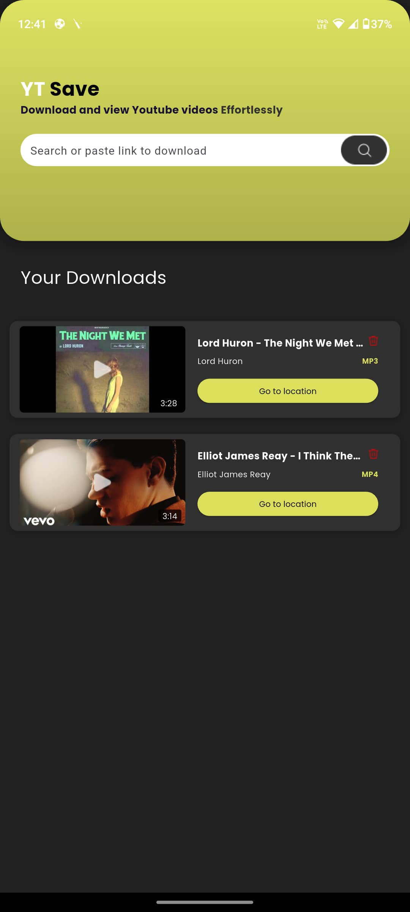
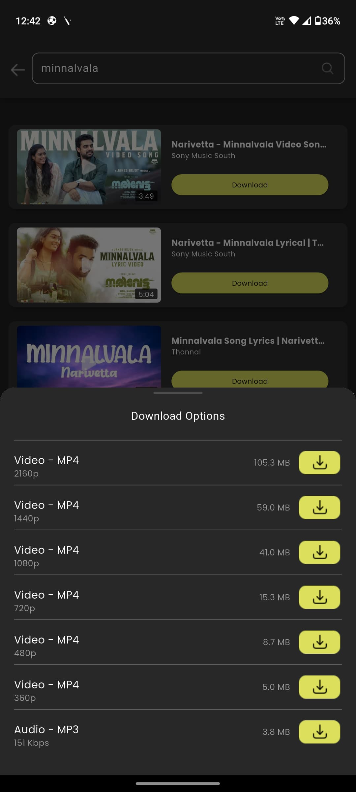

markdown
# YT Save

YT Save is a Flutter-based mobile app that allows users to search for YouTube videos, view available download streams (audio/video), and download them for offline viewing — all within a sleek and minimal UI.

---

## App Overview

- **Search YouTube videos** by title or keywords.
- **Display thumbnails**, titles, channels, and duration.
- **Download video/audio streams** with resolution options.
- **Store metadata** and downloaded files locally using Isar database.
- **View downloaded videos** in a styled Home screen.
- Clean UI/UX with custom components and Riverpod for state management.

---

## How to Run the App

### 1. Clone the Repository

```bash
git clone https://github.com/DevaduttM/YTSave.git
cd yt_save
```

### 2. Install Dependencies

```bash
flutter pub get
```

### 3. Run the App

```bash
flutter run
```

---

## Assumptions and Limitations

- **YouTube API is not used.** The app uses `youtube_explode_dart` to parse public YouTube data, which may break if YouTube changes its structure.
- Requires a **stable internet connection** to search and fetch streams.
- Downloads **do not run in the background** — closing or minimizing the app stops progress.
- No duplicate prevention. The same video can be downloaded multiple times with no warning.

---

## Screenshots

markdown





---


